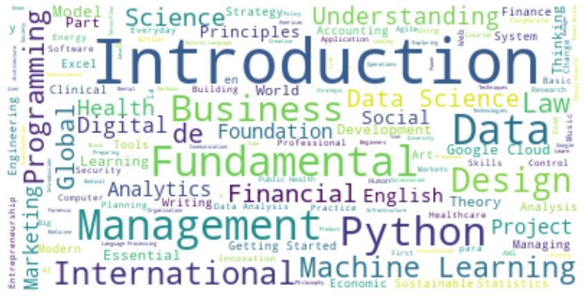
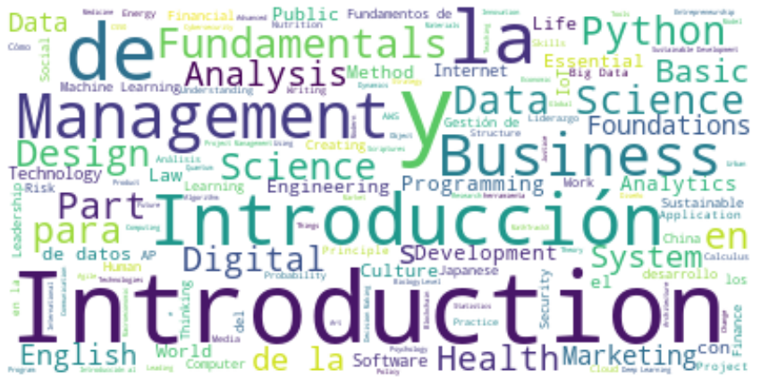
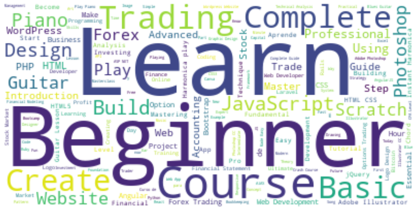

# Tercer Proyecto Individual

Para este proyecto se nos otorgo datasets donde se nos brinda informacion de plataformas de cursos online, a lo cual nosotros limpiaremos, analizaremos y representaremos en un dashboard toda la informacion que se pueda interpretar y calcular de los datasets.
Todo esto con el objetivo de brindar retroalimentacion a nuestro cliente que busca incursionar en este mercado.
Los dataset fueron obtenidos del siguiente link:
https://drive.google.com/drive/folders/1TS76ok6giW7D_l5vc-zu5-cBU_dH3P5H

## EDA

Para la plataforma de ***Coursera*** se nos brindo dos datasets, uno contiene una listado de sus cursos e informacion tal como la institucion perteneciente, url y un id que sirve para conectar con su segundo dataset que se centra en las reviews de cada curso, dando fechas, nombres y el texto de las reviews.

Se busco informacion duplicada y nula, donde solo se encontro solo una.

En el dataset de las reviews especificamente sus puntajes observamos una gran cantidad de calificacion por encima del 4.5.

Tambien observamos que las instituciones que tienen una mayor cantidad de cursos son las universidades o empresas reconocidas.

Basandonos en la cantidad de reviews a lo largo del tiempo, podemos observar un crecimiento exponencial a lo largo del año de 2020, aunque esto no es concluyente este dato proporcional a un crecimiento de consumidores de esta plataforma.

Word cloud de Coursera:

Para la plataforma de ***EDX*** este dataset contien cantidad de alumnos, insituto, tiempo del curso, precio y caracterisiticas del curso como silabos e instructores.

Se ecnotro nulos en areas de descripcion y silabos, pero en este analisis no los tomamos con informacion prescindible.

Buscamos los institutos con mayor numero de cursos, donde vemos el mismo patron al anterior, universidades y empresas reconocidos, y de la misma forma en la cantidad de alumnos.

En el idioma observamos una dominacion del idioma ingles, seguido del español.

En cuanto a la cantidad de cursos clasificados por area, observamos que areas como Computer Science y Business & Management, son de mayor demanda.

Luego vemos que la proporcion del nivel de cursos consta de una gran parte en el nivel 'introductorio'.

Y por ultimo a los diferentes precios de cada curso, observamos que una gran mayoria de cursos son de 49 dolares y observamos un patron, el precio de estos cursos en su mayoria terminan con '9'.

Word cloud de EDX:

Para la plataforma de ***Udemy***, dataset muy similar al anterior, solo que esta plataforma contiene cursos no pagos.

En busca de duplicados solo se encontro 6 y ningun nulo.

Se encontro que el area con mas cantidad de cursos es la de Web Development.

Al igual que con las otra plataformas, en cuanto al nivel de cada cursos, predomina el nivel 'principiante' y para 'todos en general'.

Y por ultimo como se nos otorga fechas en el dataset podemos ver un crecimiento constante en la plataforma, si es a lo que cursos se refiere.

Word cloud de Udemy:

